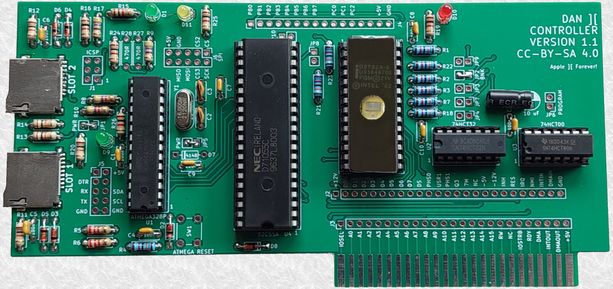
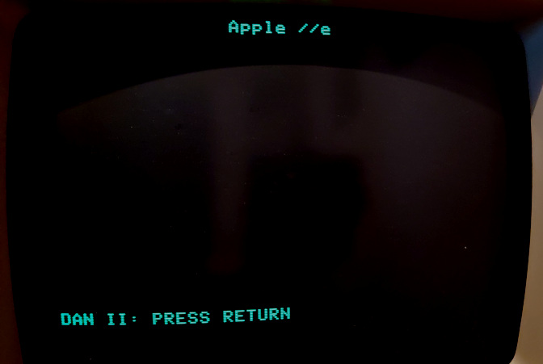
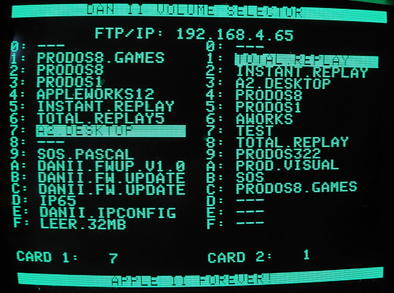
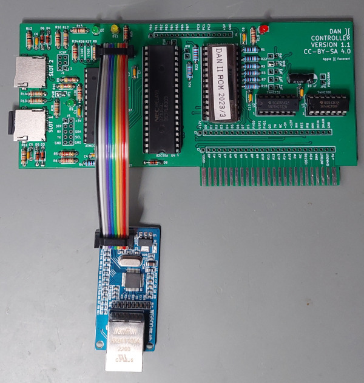
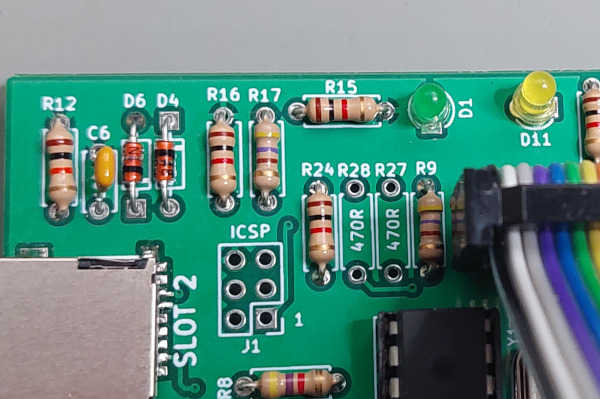
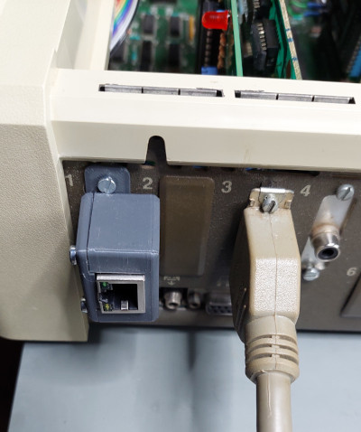
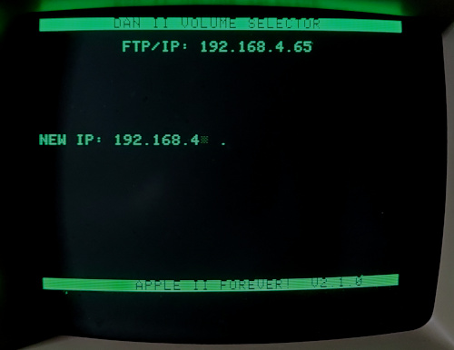

# DAN][Controller: Apple II Storage Interface, Arduino Interface & Network Interface

# Introduction
The DAN][Controller is a simple and easy to build card that provides two SD cards as mass storage devices to ProDOS.

Optionally it can be extended with a network interface using a Wiznet W5500 adapter.
The network interface provides an optional FTP server to remotely manage the Apple II volumes on the two SD cards. The network interface can also be used by the Apple II itself (using an updated [IP65](https://github.com/profdc9/ip65) network stack).

The card is based on the ATMEGA328P which is programmed with the Arduino development environment. It uses an 82C55 peripheral interface to connect to the Apple II bus.
The design uses only five commonly available integrated circuits, the 74HCT08 AND gate, 74HCT32 OR gate, 82C55A peripheral interface, an eprom/eeprom memory chip, and a ATMEGA328P microcontroller, so should be reasonably future-proofed as much as any design for a 40 year old computer can be.

# PCBs
The gerbers for the PCB are in the [Apple2Card/Gerber](/Apple2Card/Gerber) directory. You can directly send the [Apple2Card-Gerber.zip](/Apple2Card/Gerber/Apple2Card-Gerber.zip) to a PCB service like JLCPCB or PCBway, for example.

## Connectors
* The **J1** connector is the ICSP connector for programming the ATMEGA328P.
* The **J2** and **J3** connector break out the bus pins of the Apple II.
* The **J4** connect are the extra pins of the 82C55 broken out onto a connector.
* The **J5** connector is for debugging.
* The **J6** connector is for a Wiznet 5500 SPI ethernet controller (similar to Uthernet).

## Jumpers
* **JP1** is the ICSP power jumper. This needs to be closed for ICSP programming on the bench, to power the board when it is **not** plugged in an Apple II slot. Remove this jumper for ICSP programming when the board powered through an Apple II slot. This jumper doesn't matter for normal use.
* **JP5** is a power jumper to separate the power-supply of the ATMEGA328P from the supply of the 82C55, EPROM and logic ICs. **JP5 must be closed for normal use.** It is only opened for certain tests on the bench - or when you attempt ICSP programming of the card while it is plugged in an Apple II, while the Apple II is switched off.
* **JP2** is the bank switch jumper. It **always needs to be closed**. It can be hardwired/soldered closed.
* **JP3**, **JP4**, **JP6**, **JP7**, **JP8**, **JP9**, **JP10** are the programming jumpers. If an EEPROM is used then these need to be closed during onboard programming (see EEPROM.SYSTEM below). However, **these jumpers must remain open for normal use**.

## Optional Components
You may not need to solder the following components:

* Push button **SW1** is only really useful for developers. You do not need to add it otherwise.
* Resistors **R27** and **R28** should only be soldered if you intend to connect an SD card extension cable to the **J6** header. Do **not** solder these otherwise, or if you want to connect a WIZnet Ethernet adapter.
* Jumper **JP1** only matters to allow the card to be powered through an external ICSP programmer. It can be hardwired/soldered closed (unless you intend to connect an ICSP programmer while the card is installed in an Apple II slot).
* Bank switch jumper **JP2** always needs to be closed. It can be hardwired/soldered closed.
* Jumper **JP5** always needs to be closed for normal operation. You would only open it if you intend to connect an ICSP programmer when the card is installed inside the Apple II. Otherwise it can be hardwired/soldered closed.
* Jumper **JP6** only makes sense when you use an EEPROM (28Cxx) memory. Otherwise, if you use an EPROM (27Cxx) you can omit this jumper. It should be open for normal use.
* You can omit the pin headers for the **J4** extender - and for **J5**, if you do not intend to use the card for development/debugging.
* Add a pin header to **J1** to allow connecting an external ICSP programmer to the card.
* Add a pin header to **J6** to allow the extension of a WIZnet SPI network interface.

## Errata
You may need to use 4K7 resistors instead of 10K for the pull-down resistors R1/R2/R3/R7/R18/R21/R22/R23. The 10K resistors work for most, but are too weak for some 82C55 devices.

# Device Programming

## EPROM/EEPROM
For the memory device of the card an EPROM or EEPROM of 4K/8K/16K/32K can be used: a 27C32/27C64/27C128/27C256 EPROM or a 28C32/28C64/28C128/28C256 EEPROM.
Only the first 512 bytes of that memory are used. Most of the code (including the boot/configuration program for the card) is stored in the Arduino flash memory - not in the EPROM - so the contents of this memory device are not expected to change often (while the ATMEGA chip's internal flash will be subject to more frequent updates).

### EPROM Programmer
The EPROM needs to be programmed with this [eprom.bin](/eprom/bin/eprom.bin) file. It is a 512 byte file that can be burned to the memory chip using a programmer (such as a MiniPro / TL866 plus II).
Again, only the first 512 bytes are used.

### Onboard Programming
If a reprogrammable EEPROM (not EPROM) is used, there is also a program called [EEPROM.SYSTEM](utilities/eeprom/bin/EEPROM.SYSTEM) which can program the EEPROM on the board.
Jumpers JP2, JP3, JP4, JP6, JP7, JP8, JP9, and JP10 need to be closed when programming the EEPROM with the EEPROM.SYSTEM program.

**However, for normal use, jumpers JP3-JP10 must be open - while only JP2 must be closed** (JP2 can be hardwired/soldered closed).

## ATMEGA328P
The code for the ATMEGA328P is the Apple2Arduino sketch in the [Apple2Arduino](Apple2Arduino/) directory. It can be built and uploaded using the Arduino environment.
However, preferably use the provided [Apple2Arduino.ino.with_bootloader.hex](/Apple2Arduino/Apple2Arduino.ino.with_bootloader.hex) hex file, which includes the custom bootloader.

Once the binary with the custom bootloader is installed, the Apple II is able to do all further firmware updates of the ATMEGA (no more cables or ICSP programmers required).

The recommended fuse settings for the ATMEGA328P are identical to the default settings of an Arduino Uno board:

* **lfuse: 0xFF**
* **hfuse: 0xDE**
* **efuse: 0xFD**

The hfuse setting activates the use of the bootloader.

### MiniPRO / TL866 Programmer
You can program the ATMEGA328P using a programmer (such as a TL866 plus II). The project contains the matching ".hex" and "fuses.cfg" file for programming:

* `cd Apple2Arduino`
* `minipro -p 'ATMEGA328P@DIP28' -c code -w Apple2Arduino.ino.with_bootloader.hex -f ihex -e`
* `minipro -p 'ATMEGA328P@DIP28' -c config -w fuses.cfg`

### ICSP Programmer
You can also use an ICSP programmer, connect the ICSP cable to the **J1** connector of the DAN][Card and directly program the the ATMEGA328P on the board.
Any 5V Ardunio board can be ued as an ICSP programmer: simply upload the "ArduinoISP" sketch from the Arduino IDE example section and make the appropriate wire connections to the **J1** ICSP header on the DAN][ card.

**If you use the ICSP connector of the DAN][Card then no SD cards should be present in the SD slots when the ATMEGA328P is flashed.**

A command-line for programming the fuses and bootloader with "avrdude" is:

* `cd Apple2Arduino`
* `avrdude -c avrisp -p m328p -P /dev/ttyUSB0 -U lfuse:w:0xFF:m -U hfuse:w:0xDE:m -U efuse:w:0xFD:m -Uflash:w:Apple2Arduino.ino.with_bootloader.hex`

You may need to adapt "avrisp" and the "/dev/ttyUSB0" port to match your programmer device. The "avrisp" matches the ArduinoISP (e.g. an Arduino Uno board programmed to be an ISP).

# Firmware Updates
Once the custom bootloader was flashed to the ATMEGA, all further firmware updates can be done through the Apple II.
The utility is even able to recover "bricked" cards - as long as the custom bootloader was installed.

See the latest ZIP in [releases](https://github.com/ThorstenBr/Apple2Card/releases) with a disk containing the Arduino firmware update utility for the Apple II.
There is a [YT video](https://www.youtube.com/watch?v=ViGnc-YHbAo) showing the firmware update process of the controller.

Note: if you flashed your ATMEGA before the firmware update utility for the Apple II was introduced, then your ATMEGA does not yet contain the new custom bootloader.
In this case the Apple II is unable to do the update. You will need to do one more manual update using an ICSP programmer (see above).

# SD Cards
Either micro SD or micro SDHC cards may be used - with up to 32 GB capacity.

## FAT16/FAT32 Mode
You can use SD cards with either FAT16 or FAT32 file system as the first partition.
In FAT mode, the individual Apple II volumes on the SD card must be stored in the root directory of the card and must be named **BLKDEV00.PO** - **BLKDEV09.PO** or **BLKDEV0A.PO** - **BLKDEV0F.PO** (up to 16 volumes). These volumes need to contain normal Apple II ProDOS volumes (between 140K to 33MB).

An empty ProDOS volume file of 33MB is provided within the ZIP file [SingleBlankVol.zip](/volumes/SingleBlankVol.zip).

## Raw Block Mode
Alternatively, raw block mode may be used (instead of FAT formatted SD cards). Only the first 512 MB will be used for raw blocks.

To prepare SD cards for raw block mode, use the [BlankVols.zip](/volumes/BlankVols.zip) file. Unzip this file. The resulting "Blankvols.PO" file has a size of 512 MB. This needs to be written to a SD card using an utility such as Win32DiskImager or "dd" under linux. This file contains 16 concatenated and properly formatted (empty) ProDOS volumes.

## Wide Block Mode
TBD: Ordinarily, only a maximum of 64 MB is addressable, 32 MB for ProDOS drive 1, and a second 32 MB for ProDOS drive 2.  The program ALLVOLS.SYSTEM allows this limit to be circumvented in ProDOS 8.  For a SD card placed in slot 1, write the image in "BlankVols" or "BlankVolsSlot1"to it, and for a SD card in slot 2, write the image file "BlankVolsSlot2" to it.  When ALLVOLS.SYSTEM is executed, extra volumes may be added from slot 1 or slot 2 depending on if a SD card with block images is present in slot 1 or slot 2.  It is recommended that slot 1 be used for block images and slot 2 be used for FAT FS images.  This way, cards can be swapped in and out of slot 2 with different files transferred from another computer (perhaps using CiderPress) while the boot filesystem in slot 1 stays the same.

## Preparing ProDOS Volumes
ProDOS disk images can be read/written by software such as CiderPress ([a2ciderpress.com](https://a2ciderpress.com/)) so that you can use this to transfer files to and from the Apple II.
Files can be copied onto the ProDOS disk image partition which can then be read/written by CiderPress and transferred to other media.

To make a volume bootable, copy the "PRODOS.SYSTEM" and other system files to be started on booting, for example "BASIC.SYSTEM".

# Installation
The card can be installed in any Apple II slot, but slot 7 is a good choice: the Apple II starts at the highest slot number (slot 7) when searching for a bootable device.
Usually a floppy controller is installed in slot 6. So the DAN][Card should be installed in slot 7 to make it the first boot device.

# Booting the Apple II
When the card is the primary boot device then the message "DAN II: PRESS RETURN" appears on the bottom of the screen when the Apple II is booting. 

* If the **RETURN** key is pressed, then the boot menu is loaded to configure the card (see below).
* If the **ESCAPE** key is pressed, then the DAN][ Controller is skipped and the Apple II will search for the next boot device (e.g. your floppy drive).
* If any of the keys **0** to **9** are pressed, then the respective volume from SD card 1 is booted (quick access).
* If **SPACE** is pressed, then normal booting continues immediately. This will boot the volume which was *most recently* selected through the boot menu.
* If **no key** is pressed, then also normal booting of the most recently selected volume continues after a brief timeout.
 

## Boot Menu
If the RETURN key is pressed during boot up, the boot menu is loaded.
The boot menu allows the selection of the volumes.

* Use the **ARROW KEYS** (or **SPACE**/**,**) to select the active volume for each SD card.
* Alternatively press keys **0** to **9** or **A** to **F** to directly select volumes.
* Press **RETURN** to keep the current selection.
* Press **ESCAPE** to abort.
* Press **I** to enter the IP configuration dialog (if you have a Wiznet adapter, see below).

After selecting the volumes of the two slots, the system continues booting.

# Ethernet/Network Interface
The card can be extended with an Ethernet interface. A cheap Wiznet 5500 device can be connected to **J6** using a ribbon cable as indicated:

It's recommended to leave out the two resistors R27 and R28 on the controller PCB when you connect the WIZnet. These resistors connect signals to the J6 header which are not meant for the WIZnet device.

LED D11 (just above the J6 header) indicates network activity of the WIZnet adapter.

## Mounting Bracket
The [CAD](/CAD) folder contains different STL designs for 3D printed brackets, which can be used to mount the WIZnet Ethernet adapter into the back of an Apple II.

## FTP Access
When the Ethernet adapter is installed you can use FTP to remotely access the SD cards. The FTP access is very limited and only allows up- and downloading volumes to the volume files.
The volumes are shown in two separate directories (SD1 and SD2) and list the volume files BLKDEV00.PO-BLKDEV0F.PO.
Other files and other directories stored on **FAT** format disks are not accessible via FTP (any unrelated files and folders will stay on the SD cards, but neither be visible nor writable via FTP).

The Apple II access is suspended as soon as any FTP session is active. Disconnect your FTP client to resume Apple II access to the volumes.

FTP data is transfered at about **170-200KB/s**. 140K disk-sized image transfers in less than a second. Full-sized 33MB images require about 2:45 minutes.

Notice that any RESET of the Apple II also resets the DAN][Controller and the network device. So avoid pressing Ctrl-RESET on the Apple II while up- or downloading volume images via FTP.

### Preparing SD Cards for FTP
The FTP server cannot create new files, nor rename files. It also cannot enlarge files.

#### SD Cards with FAT Format
Prepare fresh SD cards before installing them by creating all required volume files (BLKDEV0X.PO) in the root folder of the SD card:
Just use an empty 33MB ProDOS template for each file.
The FTP server is able to upload/download data to a volume as soon as the respective file exists.

Even if you prepare the SD card using ProDOS images of the maximum supported size (33MB), you will still be able to upload smaller ProDOS images via FTP (smaller is no problem, just larger files wouldn't work).

You can upload files of any supported size. Small standard 140K floppy disk **ProDOS** images also work (not just large harddrive volumes).

#### SD Cards with RAW Block Mode
FTP access is also supported for SD cards using "**Raw Block Mode**" (see above). The SD card format is automatically detected. The volumes stored on raw block SD cards are also visible via FTP with standard filenames (BLKDEV00.PO-BLKDEV0F.PO) - just as if the SD card was using a FAT filesystem.

The normal preparation of SD cards for Raw Block Mode (writing the "Blankvols.PO" to the card, see above) is enough to make these cards also available for FTP access. The directory list of the FTP root directory also shows which format was detected for each SD card (RAW vs FAT).

### IP Configuration
The FTP server requires a fixed IP address. It is configured through the boot menu:

* As normal, press **RETURN** after booting to enter the boot menu.
* Then press '**I**' instead of selecting a boot volume.
* Then enter the new IP address.
* To disable the FTP server, set the IP to "0.0.0.0".

The IP configuration is stored persistently.

The FTP server is active when a Wiznet module is connected and an IP adress is configured. The IP address is also shown in the boot menu.

### Advanced FTP Clients
The FTP server is limited to a single connection. If you use advanced FTP clients, like FileZilla, then you need to configure the FTP connection: see the "connection properties" and enable "Limit number of simulataneous connections" and set the limit to "1":

### FTP ProDOS Features
Notice that ProDOS volume names and volume sizes are displayed via FTP. The owner/group information is (ab)used to report the ProDOS volume name - while the normal FTP file names are the normal DOS file names.

## Apple II Ethernet Access
Alternatively to the FTP support, it is also possible for the Apple II to directly access the WIZnet Ethernet port. There is an extension for the IP65 network stack which adds support for the DAN][Controller interface to the WIZnet adapter.
See the [dsk](/dsk) folder for an example disk with IP65 examples (telnet client, ntp time synchronisation etc).

There is also a variant of **ADTPro** with the updated IP65 stack, supporting the DAN][ controller's Ethernet port - see [here](https://github.com/ThorstenBr/adtproDAN2/releases).

Notice that the FTP server on the DAN][ Controller is shutdown whenever the Apple II itself accesses the Ethernet port (using IP65).

# License
Copyright (c) 2022 Daniel L. Marks 
Copyright (c) 2023 Thorsten C. Brehm

This software is provided 'as-is', without any express or implied
warranty. In no event will the authors be held liable for any damages
arising from the use of this software.

Permission is granted to anyone to use this software for any purpose,
including commercial applications, and to alter it and redistribute it
freely, subject to the following restrictions:

1. The origin of this software must not be misrepresented; you must not
   claim that you wrote the original software. If you use this software
   in a product, an acknowledgment in the product documentation would be
   appreciated but is not required.
2. Altered source versions must be plainly marked as such, and must not be
   misrepresented as being the original software.
3. This notice may not be removed or altered from any source distribution.